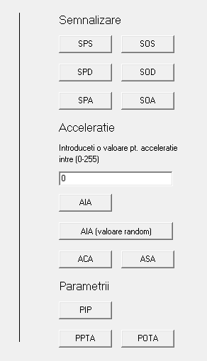

# Automotive Main-Board System Simulation (Ro)
HCS08 Microcontrollers Family, MC9S08AW60 Series

## Structuri
### Trimitere pachete de date

```c
struct package {
   unsigned char ID;
   unsigned char size;
   unsigned char data[5];
   unsigned char checksum;
}pack;
```

* ```pack.ID``` este ID-ul comenzii trimise
* ```pack.size``` este lungimea vectorului de date (```pack.data[size]```) din pachetul trimis  
* ```pack.data[..]``` este vectorul de date
* ```pack.checksum``` este calculat ca suma valorilor hex din: ```pack.ID```, ```pack.size```, ```pack.data[..]``` 

### FSM semnalizari


#### Structura
```c
struct stransition {
   unsigned char state;
   unsigned char cmd;
   unsigned char new_state;
   unsigned char output[2];
};
```
* ```state``` este starea actuala a dispozitivului
* ```cmd``` este ID-ul comenzii date
* ```new_state``` este noua stare in care va trece dispozitivul
* ```output[2]``` sunt starea LED-urilor de semnalizare (stanga, dreapta), 0 - stinse, 1 - aprinse

#### Stari implementate

```c
#define DEFAULT 0
#define SS 1
#define SD 2
#define AV 3
#define SSAV 4
#define SDAV 5

struct stransition strans[14] = {
   {DEFAULT, SPS, SS, 1, 0},
   {DEFAULT, SPA, AV, 1, 1},			
   {DEFAULT, SPD, SD, 0, 1},
   {SS, SOS, DEFAULT, 0, 0},
   {SS, SPA, SSAV, 1, 1},
   {SD, SOD, DEFAULT, 0, 0},
   {SD, SPA, SDAV, 1, 1},
   {AV, SPS, SSAV, 1, 1},
   {AV, SOA, DEFAULT, 0, 0},
   {AV, SPD, SDAV, 1, 1},
   {SSAV, SOA, SS, 1, 0},
   {SSAV, SOS, AV, 1, 1},
   {SDAV, SOA, SD, 0, 1},
   {SDAV, SOD, AV, 1, 1}
};
```

## Comenzi
### Lista comenzi
#### SEMNALIZARE 
* **SPS** Pornire stanga  
* **SOS** Oprire stanga  
* **SPD** Pornire dreapta  
* **SOD** Oprire dreapta  
* **SPA** Pornire avarie  
* **SOA** Oprire avarie  
#### ACCELERATIE
* **AIA** Impunere acceleratie
* **ACA** Crestere acceleratie
* **ASA** Scadere acceleratie  
#### PARAMETRII
* **PIP** Interogare parametrii -> raspuns cu **PRI**

### Informatii
```c
void cautare_comanda(unsigned char comanda)
```
* In aceasta functie se va cauta comanda trimisa si se va executa codul respectiv comenzii date
* **Semnalizarile** folosesc **FSM** descris mai sus pt. a controla LED-urile de semnalizare
```c
for(i = 0; i < (sizeof(strans)/sizeof(strans[0])); i++) {
   if((strans[i].state == current_state) && (strans[i].cmd == comanda)) {
      current_state = strans[i].new_state;
      semnalizare_stanga = strans[i].output[0];
      semnalizare_dreapta = strans[i].output[1];
      break;
   }
}
```
* **Acceleratia** foloseste o variabila ```data_acceleratie``` care va avea o valoare intre 0 - 255,
iar in functie de valoare se vor aprinde LED-urile specifice unde la 0 sunt stinse toate iar la 255 sunt aprinse toate
```c
if(data_acceleratie >= 1 && data_acceleratie <= 51)
   PTFD |= 0x40;	
else if(data_acceleratie >= 52 && data_acceleratie <= 102)
   PTFD |= 0x60;
else if(data_acceleratie >= 103 && data_acceleratie <= 153)
   PTFD |= 0x70;
else if(data_acceleratie >= 154 && data_acceleratie <= 204)
   PTFD |= 0x78;
else if(data_acceleratie >= 205 && data_acceleratie <= 254)
   PTFD |= 0x7c;
else if(data_acceleratie == 255)
   PTFD |= 0x7e;
```
* pt. comenzile de tip **ACA** si **ASA**, ```data_acceleratie``` va creste/scadea cu o valoare ```val_acceleratie``` impusa 
* **Parametrii** detine o singura comanda **PIP** care va interoga parametrii placii prin tratarea seriala iar acestia vor fi transmisi inapoi spre PC tot printr-un raspuns de tip ACK **PRI**, un ```data.size``` de parametrii, cativa ```data.params[..]``` precum valoarea 
```data_acceleratie```, starea usilor(cele 4 switch-uri), starea semnalizarilor, starea celor 8 switch-uri si inca un octet 
```data.checksum``` care va reprezenta suma octetilor transmisi anterior de **PRI**
```c
if(comanda == PIP) {
   unsigned char sum = 0x00;
   unsigned char pip_size = 0x01;
   sum = (unsigned char)PRI + pip_size + data_acceleratie;
   while(!(SCI1S1 & 0x80)); //asteptam terminare transmisie 
   SCI1D = PRI;
   while(!(SCI1S1 & 0x80));
   SCI1D = pip_size;
   while(!(SCI1S1 & 0x80));
   SCI1D = data_acceleratie;
   while(!(SCI1S1 & 0x80));
   SCI1D = sum;
}
```

## Exemple
### Definitii ID comenzi
```c
#define SPS 1  
#define SOS 2  
#define SPD 3  
#define SOD 4  
#define SPA 5  
#define SOA 6  
#define AIA 7
#define ACA 8
#define ASA 9
#define PIP 10
#define PRI 11 // (raspuns la PIP)
```

### Exemple pachete de date
Pornire LED stanga (valori hex): ```01 00 01``` -> 01 ```pack.ID```, 00 ```pack.size```, 01 ```pack.checksum```  
Pornire LED-uri avarie (valori hex): ```05 00 05``` -> 05 ```pack.ID```, 00 ```pack.size```, 05 ```pack.checksum```  
Oprire LED-uri dreapta (valori hex): ```04 00 04``` -> 04 ```pack.ID```, 00 ```pack.size```, 04 ```pack.checksum```  
Impunere acceleratie(aprinde toate LED-urile de acceleratie):  ```07 01 ff 07``` -> 07 ```pack.ID```, 01 ```pack.size```, ff ```pack.data[0]```, 07 ```pack.checksum```    
Interogare parametrii:  ```10 00 10``` -> 10 ```pack.ID```, 00 ```pack.size```, 10 ```pack.checksum``` 

(in cazurile cand se lucreaza cu semnalizarile, LED-urile vor fi aprinse 60% dintr-o secunda si vor fi stinse in rest)

### Serial API
In loc sa trimitem mereu manual parametrii, folosim comenzile deja setate in interfata grafica


